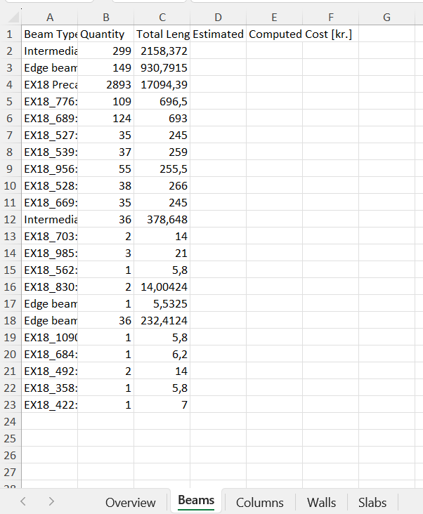

# A3 - Tool

## Problem/claim
The tool aims to automate the process of collecting data on structural elements' dimensions and quantity, providing early cost estimates to stakeholders and contractors. This will help in verifying design details, ensuring compliance, and facilitating accurate project cost projections.

## Where the problem was found:
The problem is discussed in section A2b, which highlights the need for a system that automates the collection of structural element data and helps estimate costs during the design phase.

## Description of tool/how to use tool
As mentioned earlier, our tool will be able to identify the dimensions, type, and quantity of all structural elements (beams, walls, columns, and slabs). Following this, a price estimation for the structural elements can be generated.

This has been achieved by dividing the Python script into two separate scripts:

### A3_STR_GR26_1 - Defining all elements
The first script defines all the elements in the model. It calculates the length of all beams in the IFC model, as well as the volumes of columns, slabs, and walls, along with the quantity of each type.
Once the code has been executed, the script generates an Excel file with all the structural elements listed in separate sheets. After running the code, the output will be an Excel file that looks like this:

### Prework before using 2nd script
Now that all the structural elements have been defined and inserted into the Excel sheets, the overall cost can be calculated. At this stage, the project manager needs to input the costs for each element. In this script, the cost of beams is estimated per length, while the other elements are estimated per volume. This is, of course, adjustable, but for this example, we used this method, assuming the beams are predefined and only the length is required. For slabs, this approach may also apply in some projects, and it can be modified in the script accordingly.

The prices need to be inserted into the Excel file, after which the file should be saved. It will then look like this:

